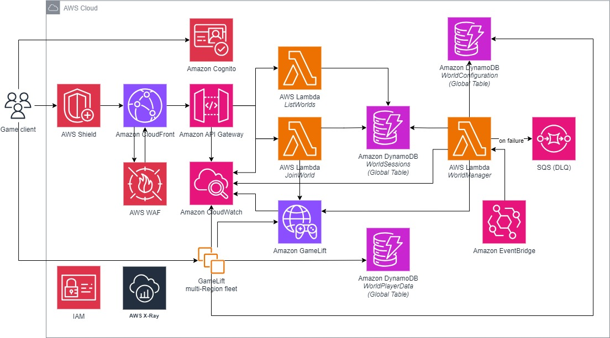
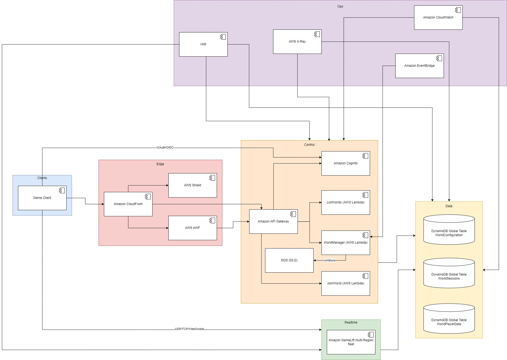

# Cache Distribuido con FastAPI, SQLite y Docker

Este proyecto implementa un sistema de caché distribuido, con persistencia local por nodo en SQLite, API HTTP con FastAPI y replicación best-effort entre nodos.


## Índice

- [Tecnologías](#tecnologías)
- [Estructura](#estructura)
- [Ejecución local (sin Docker)](#ejecución-local-sin-docker)
- [Ejecución con Docker (1 nodo)](#ejecución-con-docker-1-nodo)
- [Ejecución con Docker Compose (clúster de 3 nodos)](#ejecución-con-docker-compose-clúster-de-3-nodos)
- [Endpoints principales](#endpoints-principales)

- [Arquitectura del Sistema de Juego Multijugador](#arquitectura-del-sistema-de-juego-multijugador)
  - [Diagrama General de Arquitectura](#diagrama-general-de-arquitectura)
  - [Diagrama de Componentes](#diagrama-de-componentes)
  - [Sección 1 - Flujo de la Arquitectura](#sección-1---flujo-de-la-arquitectura)
  - [Alta concurrencia y baja latencia](#alta-concurrencia-y-baja-latencia)
  - [Consistencia y fiabilidad de los datos](#consistencia-y-fiabilidad-de-los-datos)
  - [Escalabilidad y tolerancia a fallos](#escalabilidad-y-tolerancia-a-fallos)
  - [Seguridad y privacidad](#seguridad-y-privacidad)
  - [Stack tecnológico y justificación](#stack-tecnológico-y-justificación)
  - [Estrategia de almacenamiento y gestión de datos](#estrategia-de-almacenamiento-y-gestión-de-datos)
  - [Mecanismos de escalabilidad](#mecanismos-de-escalabilidad)
  - [Tolerancia a fallos](#tolerancia-a-fallos)
  - [Medidas de seguridad](#medidas-de-seguridad)

- [sección 2](#sección-2)
- [¿Cómo funciona el caché distribuido?](#cómo-funciona-el-caché-distribuido)
- [Cómo este proyecto cumple los objetivos](#cómo-este-proyecto-cumple-los-objetivos)
- [Variables de entorno](#variables-de-entorno)
- [Colección Postman](#colección-postman)
- [Notas y mejoras posibles](#notas-y-mejoras-posibles)


## Tecnologías
- FastAPI (API HTTP y validación)
- Uvicorn (ASGI server)
- Pydantic (modelos de datos)
- SQLite (persistencia local por nodo)
- httpx (replicación asíncrona entre nodos)
- Docker / Docker Compose (orquestación de nodos)
- Pytest (tests)

## Estructura
- `server/main.py`: Endpoints y lógica de negocio (memoria + TTL + versionado + replicación)
- `server/persistence.py`: Acceso a SQLite (creación de tabla, guardar, cargar, borrar)
- `server/config.py`: Configuración (variables de entorno, rutas internas, path DB)
- `server/utils/replication.py`: Replicación HTTP a otros nodos
- `server/schemas/cache_item.py`: Modelo de entrada para items del caché
- `docker-compose.yml`: Define 3 nodos del clúster
- `Dockerfile`: Imagen base Python 3.11 con app y dependencias
- `postman/cache-demo-collection.json`: Colección para probar

---

## Ejecución local (sin Docker)

### Requisitos
- Python 3.11+

### 1) Crear y activar entorno virtual
- Windows (PowerShell):
  ```powershell
  python -m venv .venv
  . .venv\Scripts\Activate.ps1
  ```
- macOS / Linux (bash):
  ```bash
  python3 -m venv .venv
  source .venv/bin/activate
  ```

### 2) Instalar dependencias
```bash
pip install -r requirements.txt
```

### 3) Ejecutar la API
```bash
uvicorn server.main:app --reload --host 0.0.0.0 --port 8000
```
- Documentación interactiva: `http://localhost:8001/docs`

### 4) Ejecutar tests
```bash
pytest -q
```

> Nota: el proyecto inicializa la base de datos al importar `server/persistence.py`, por lo que los tests funcionan sin eventos de startup.

---

## Ejecución con Docker (1 nodo)

```bash
docker build -t jikkosoft-cache .

docker run --rm -p 8001:8000 \
  -e NODE_ID=node1 \
  -e NODES="http://localhost:8001" \
  -e INTERNAL_TOKEN=secret \
  -v $(pwd)/data/node1:/app/data \
  jikkosoft-cache
```
- API en `http://localhost:8001`
- Docs en `http://localhost:8001/docs`

> En Windows PowerShell, sustituye `$(pwd)` por la ruta absoluta del proyecto, por ejemplo: `-v C:\ruta\al\repo\data\node1:/app/data`.

---

## Ejecución con Docker Compose (clúster de 3 nodos)

```bash
docker compose up --build
```
Nodos:
- Node 1: `http://localhost:8001`
- Node 2: `http://localhost:8002`
- Node 3: `http://localhost:8003`

Cada servicio monta su directorio de datos persistente: `./data/nodeX -> /app/data`.

Variables de entorno relevantes:
- `NODE_ID`: `node1` | `node2` | `node3`
- `NODES`: lista separada por comas de URLs internas de los nodos
- `INTERNAL_TOKEN`: token compartido para llamadas internas y evitar bucles de replicación

---

## Endpoints principales

- PUT `/cache/{key}`
  - Body (JSON):
    ```json
    {
      "value": {"cualquier": "json"},
      "version": 1,
      "ttl_ms": 30000
    }
    ```
  - Respuesta: `{ "status": "stored", "node": "node1" }`
  - Notas:
    - `version` es obligatoria (entero incremental). Se rechaza con 409 si no supera la versión existente.
    - `ttl_ms` es opcional; si se omite, el ítem no expira.

- GET `/cache/{key}`
  - Respuesta (200):
    ```json
    {
      "value": {"cualquier": "json"},
      "version": 1,
      "expires_at": "2025-01-01T00:00:00.000000"
    }
    ```
  - 404 si no existe o si expiró (mensaje `Expired` o `Not found`).

- DELETE `/cache/{key}`
  - Respuesta: `{ "status": "deleted", "node": "node1" }`

- GET `/_health`
  - Respuesta: `{ "node": "node1", "status": "ok" }`

### Ejemplos (cURL)

```bash
# Guardar con TTL 30 segundos y versión 1
curl -X PUT "http://localhost:8001/cache/k1" \
  -H "Content-Type: application/json" \
  -d '{"value": {"x": 1}, "version": 1, "ttl_ms": 30000}'

# Consultar
curl "http://localhost:8001/cache/k1"

# Borrar
curl -X DELETE "http://localhost:8001/cache/k1"
```

> Las llamadas internas entre nodos usan la cabecera `X-Internal-Token: <INTERNAL_TOKEN>` y no requieren intervención del cliente.

---

# Arquitectura del Sistema de Juego Multijugador

## Diagrama General de Arquitectura
<p align="center">
  
</p>

## Diagrama de Componentes
<p align="center">
  
</p>

---

## Sección 1 - Flujo de la Arquitectura

1. **Inicio de sesión:** El jugador obtiene su identidad en Cognito.  
2. **Lista de mundos:** El cliente pide a API Gateway la lista de partidas; Lambda consulta DynamoDB y devuelve la información.  
3. **Unirse a una partida:** Otra Lambda revisa que haya espacio y crea la sesión del jugador en GameLift.  
4. **Conexión en tiempo real:** El cliente se conecta directamente al servidor del juego con los datos recibidos.  
5. **Juego activo:** GameLift valida y gestiona la partida, guardando información importante en DynamoDB.  
6. **Mantenimiento:** Un proceso programado revisa partidas activas, inicia o detiene mundos según sea necesario y envía métricas a CloudWatch.  

---

## Alta concurrencia y baja latencia

- **En el borde (Edge):** CloudFront, WAF y Shield reciben las peticiones antes de llegar a la nube. Esto ayuda a manejar miles de conexiones, proteger de ataques y acercar el contenido al jugador.  
- **Plano de control sin servidores:** Usamos API Gateway y funciones Lambda, que se adaptan automáticamente al número de solicitudes sin necesidad de servidores fijos.  
- **Tiempo real optimizado:** La comunicación del juego (movimientos, acciones) va directa al servicio GameLift, reduciendo pasos y ganando velocidad.  
- **Regiones cercanas:** El sistema conecta a cada jugador al servidor más cercano geográficamente para minimizar el retraso.  

---

## Consistencia y fiabilidad de los datos

- DynamoDB con replicación global para que los datos estén disponibles en varias regiones.  
- Datos críticos manejados con reglas de idempotencia para evitar duplicados o errores.  
- El estado real lo mantiene GameLift; DynamoDB guarda información de referencia.  
- Sesiones caducadas se eliminan automáticamente con procesos programados.  

---

## Escalabilidad y tolerancia a fallos

- Diseño horizontal: Lambdas y API Gateway manejan desde pocos hasta miles de jugadores sin cambios manuales.  
- GameLift y DynamoDB en múltiples zonas de disponibilidad y regiones.  
- Reintentos automáticos y colas para manejar fallos temporales.  
- Monitoreo con CloudWatch y X-Ray.  

---

## Seguridad y privacidad

- Amazon Cognito da credenciales temporales con permisos mínimos.  
- WAF y Shield protegen contra ataques.  
- Comunicación cifrada y datos almacenados de forma segura.  
- Servidores aislados en red privada.  
- Mínima información personal almacenada.  

---

## Stack tecnológico y justificación

- **Cliente:** Unity/Unreal → aceleran el desarrollo, redes integradas y fácil integración cloud.  
- **Protección y distribución:** CloudFront + WAF + Shield → respuesta rápida, filtrado y mitigación de ataques.  
- **Autenticación:** Amazon Cognito → identidades seguras sin login propio.  
- **Gestión de solicitudes:** API Gateway + Lambda → escalables y facturación por uso.  
- **Juego en tiempo real:** Amazon GameLift → hosting optimizado para juegos con baja latencia.  
- **Datos:** DynamoDB Global Tables → velocidad y replicación multi-región.  
- **Automatización y monitoreo:** EventBridge, CloudWatch, X-Ray → tareas programadas y visibilidad del sistema.  
- **Seguridad:** IAM → permisos mínimos y controlados.  

---

## Estrategia de almacenamiento y gestión de datos

**Tablas lógicas:**
- **WorldConfiguration:** Configuración fija de cada mundo.  
- **WorldSessions:** Lista de partidas activas y conectados.  
- **WorldPlayerData:** Progreso y estadísticas no críticas.  

**Reglas clave:**
- Validaciones de cupo antes de unir jugadores.  
- Lecturas rápidas y flexibles para lista de mundos.  
- Índices por estado y región.  
- Limpieza automática de partidas viejas.  
- Cifrado y mínima información personal.  

---

## Mecanismos de escalabilidad

- API Gateway y Lambda se adaptan solos al tráfico.  
- DynamoDB ajusta capacidad automáticamente.  
- GameLift escala servidores según demanda.  
- CloudFront distribuye la carga global.  

---

## Tolerancia a fallos

- Multi-zona y multi-región.  
- Capacidad de mover jugadores a otra región.  
- Reintentos automáticos y manejo de errores.  
- Recuperación automática de estados.  

---

## Medidas de seguridad

- Filtrado de tráfico malicioso (WAF, Shield).  
- Credenciales temporales (Cognito).  
- Cifrado y aislamiento de servidores.  
- Registros y auditorías.  
- Mínima recolección de datos personales.  


## sección 2

## ¿Cómo funciona el caché distribuido?

### Memoria + Persistencia (Write-through)
- Cada nodo mantiene un diccionario en memoria: `key -> { value, version, expires_at }`.
- En cada `PUT`, se escribe en memoria y también en SQLite (write-through) para durabilidad.
- En el arranque, cada nodo carga sus datos desde SQLite y limpia elementos expirados.

### TTL (caducidad)
- `ttl_ms` define el tiempo de vida. Se computa `expires_at` en UTC.
- En `GET`, si el elemento está expirado, se elimina (memoria + DB) y retorna 404 (`Expired`).
- En el arranque se limpia lo expirado. No hay job de limpieza continuo en segundo plano (simplificación del demo).

### Replicación entre nodos (best-effort, asíncrona)
- En `PUT`/`DELETE` externos, el nodo replica la petición al resto vía HTTP asíncrono (`httpx`).
- Se evita replicar al propio nodo usando su URL interna (`self_internal_url`).
- Se usa `X-Internal-Token` para marcar llamadas internas y evitar bucles.
- Errores de red se ignoran en el demo (eventual consistency): la red o el nodo remoto puede fallar sin bloquear la escritura local.

### Conflictos y Consistencia
- Modelo de consistencia: eventual.
- Resolución de conflictos por versión (Last-Writer-Wins con entero creciente):
  - Si llega un `PUT` con `version <= versión_actual`, se rechaza con 409.
  - Los clientes deben aumentar la versión para cada actualización.
- Dado que la replicación es asíncrona, nodos pueden estar temporalmente desincronizados; con el tiempo convergen.

---

## Cómo este proyecto cumple los objetivos

1) Almacenar y recuperar datos de manera eficiente
- Acceso en memoria O(1) por clave para `GET`/`PUT`/`DELETE`.
- Persistencia SQLite para reinicios sin pérdida.
- Serialización JSON para valores arbitrarios.

2) Manejar problemas de consistencia distribuida
- Replicación asíncrona best-effort entre nodos para disponibilidad.
- Prevención de bucles de replicación con `X-Internal-Token` y autoexclusión por URL.
- Resolución de conflictos con versionado LWW (entero creciente) y 409 en versiones obsoletas.
- Eventual consistency: converge cuando la comunicación se restablece.

3) Proporcionar mecanismos para invalidación y caducidad (TTL)
- `ttl_ms` por item; cálculo de `expires_at` en `PUT`.
- Purga en `GET` cuando expira y limpieza en arranque.
- `DELETE` explícito para invalidación inmediata y replicada.

---

## Variables de entorno
- `NODE_ID` (por defecto `node1`)
- `NODES` (lista de URLs internas separadas por comas)
- `INTERNAL_TOKEN` (por defecto `secret`)

## Colección Postman
Importa `postman/cache-demo-collection.json` y apunta a `http://localhost:8001`, `8002`, `8003` según el nodo.

## Notas y mejoras posibles
- Migrar `@app.on_event("startup")` a manejadores de lifespan (FastAPI) para evitar warnings.
- Añadir un limpiador periódico de expirados.
- Retries/backoff y métricas para replicación.
- Autenticación/autorización para clientes externos.
